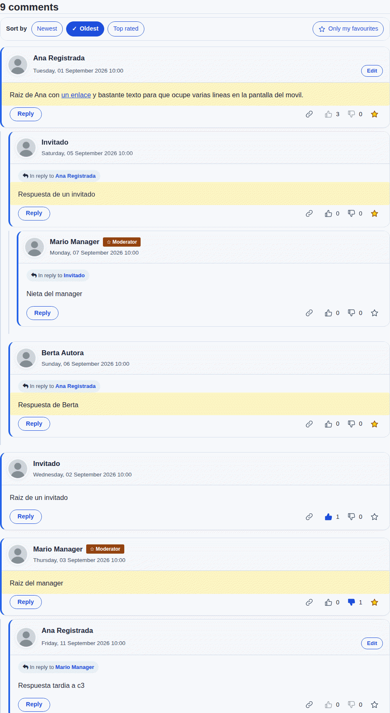
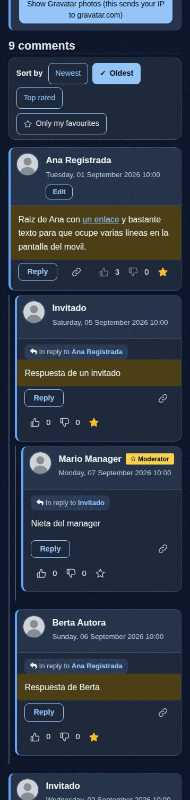
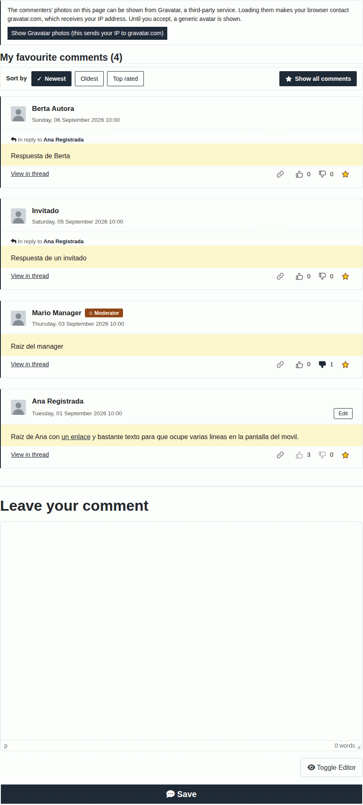

# Ordenar, favoritos, copiar enlace e insignias (0.8.0)

Copyright (c)2026 fork comunitario de Engage iniciado por ChasKa; GNU General Public License v3 o posterior.

Segunda tanda de peticiones de ChasKa sobre la lista de comentarios del sitio. Son cuatro funciones que se apoyan en las reacciones de la 0.7.x ([`REACCIONES.md`](REACCIONES.md)) y en el permalink que el componente ya generaba (`akengage_cid` + ancla `#akengage-comment-<id>`).

## Qué hay

1. **Ordenar por** (cabecera de la lista): **Más recientes**, **Más antiguos** y **Más valorados** (me gusta menos no me gusta; a igualdad, el más reciente primero). El orden afecta a los comentarios de **primer nivel**; las respuestas siguen **debajo de su comentario, de la más antigua a la más reciente**. Respeta la paginación (la elección viaja en los enlaces de las páginas) y `max_level` (el nivel máximo solo decide a quién contesta el botón «Responder»; el hilo se ve igual). «Más valorados» solo existe con las reacciones activadas.
2. **Solo mis favoritos** (botón junto al orden): para quien tiene sesión. Lista **plana** con los comentarios publicados de este artículo que la persona marcó con la estrella, cada uno con su «En respuesta a…» y un enlace **«Ver en el hilo»** (el permalink de siempre) a su sitio en la lista completa. Con orden y paginación. Si no hay ninguno, un mensaje claro y el botón para volver.
3. **Copiar enlace**: botón de contorno (icono de eslabón, SVG propio) en la fila de abajo de cada comentario publicado, junto a las reacciones. Copia al portapapeles el enlace permanente del comentario y avisa «Enlace copiado» en una región `role="status"` (sin `alert()` ni `confirm()`).
4. **Insignias** junto al nombre: **Autor** (quien comenta es el autor del artículo) y **Moderador** (quien tiene `core.edit.state` o `core.manage` en el componente, evaluado con la ACL de Joomla). Solo texto: nunca nombres de grupo, identificadores ni permisos. La estrella de moderador que ya veían los moderadores en la cabecera **no se repite** cuando el comentario ya lleva la insignia «Moderador».

## Opciones (Opciones > Apariencia; en las opciones modernas, categoría Diseño)

| Opción | Valores | Por defecto | Efecto |
|---|---|---|---|
| `sort_selector` | Sí / No | **Sí** | Barra «Ordenar por» y botón «Solo mis favoritos». Con «No» se ignoran `akengage_sort` y `akengage_fav` y el HTML vuelve a ser el de la 0.7.1. |
| `default_sort` | `auto` / `newest` / `oldest` / `top` | **`auto`** | Orden mientras el visitante no elija otro. `auto` respeta la opción de siempre **«Orden de los comentarios»** (`comments_ordering`). `top` solo se aplica con las reacciones activadas. Vale aunque el selector esté apagado. |
| `copy_link` | Sí / No | **Sí** | Botón «Copiar enlace» en cada comentario publicado. |
| `show_badges` | Sí / No | **Sí** | Insignias «Autor» y «Moderador». |

**Por qué estos valores por defecto.** Todo en «Sí» menos el orden inicial en «Automático»: así nadie cambia su orden sin querer (`comments_ordering` sigue mandando) y las funciones nuevas están a mano. Para que el tema **Clásico** (el aspecto original) no cambie de color, los botones nuevos usan `currentColor` (heredan el color del texto de la plantilla y, por eso, se leen en cualquier plantilla clara u oscura), los enlaces de orden son botones de contorno y las insignias son **gris oscuro neutro con texto blanco** (10:1). Los temas Moderno, Minimalista y Oscuro usan sus propias variables (`--eg-enlace`, `--eg-aviso`, `--eg-texto-suave`, `--eg-fondo`, `--eg-borde`...: no hay variables nuevas). Todos los valores se validan en el servidor como lista cerrada o 0/1; cualquier otro se trata como el valor por defecto.

**Comportamiento idéntico a la 0.7.1 con todo apagado.** Con `sort_selector`, `copy_link` y `show_badges` en «No» y `default_sort` en «Automático», la sección de comentarios (HTML, etiquetas de script y estilo, opciones de script y textos) es **idéntica byte a byte** a la de la 0.7.1 en 12 combinaciones de tema, reacciones, CSS propio, orden y nivel máximo, vista como invitado, Registered y Manager (comprobado, ver «Pruebas»).

## Cómo funciona

### Orden

- La elección viaja en la URL: `?akengage_sort=newest|oldest|top` (y `akengage_limitstart=0` para volver a la primera página; el enlace lleva además el ancla `#akengage-comments-section`). Es una **lista cerrada**: `ListOrdering::sortMode()` compara con igualdad estricta (`newest`, `oldest`, `top`; ni mayúsculas, ni espacios, ni saltos de línea, ni arrays); cualquier otra cosa es «sin elección». El valor recibido **nunca llega al SQL**: el modo se traduce con `ListOrdering::sortOrderBy()` a columnas y direcciones fijas (`c.created`, `c.id` y el alias `reaction_score`, que no está en la lista del panel ni en la del listado público).
- Los enlaces de orden llevan `rel="nofollow"`. Cuando hay una elección en la URL, la página añade `<link rel="canonical">` hacia la misma página **sin** parámetros de este fork (si Joomla o el sitio ya declararon un canonical no se añade otro), para que los buscadores no indexen tres veces los mismos comentarios. No hace falta `noindex`.
- **Más valorados**: una subconsulta agregada sobre `#__engage_reactions` (me gusta = +1, no me gusta = -1; con «No me gusta» desactivado solo suman los me gusta), unida por `comment_id` al índice único existente `(comment_id, user_id, type)` y limitada a los comentarios del mismo contenido (`:rs_asset` enlazado). **Deja fuera las reacciones del autor a su propio comentario**, igual que los contadores que ve la gente (`ReactionStore::counts`), y los comentarios sin reacciones valen 0. El árbol (respuestas debajo de su padre) se sigue construyendo en PHP, como siempre; las respuestas se reordenan cronológicamente antes de armarlo.
- **Sin elección** manda lo de siempre (`comments_ordering`, o `default_sort` si no es `auto`) y se mantiene el comportamiento anterior, incluido el orden entre hermanos. Con `comments_ordering = desc` y sin elección, las respuestas siguen saliendo de la más reciente a la más antigua (como en la 0.7.1); al **elegir** un orden las respuestas pasan a ir siempre de la más antigua a la más reciente.
- `akengage_cid` (el enlace permanente) calcula la página con el orden activo, así que un enlace con `akengage_sort` abre la página que contiene el comentario en ese orden.

### Caché de página

- El HTML de la barra es el mismo para todo el mundo: las URL de orden son relativas (sin esquema ni anfitrión) y el conmutador de favoritos viene **oculto** (`hidden`). Cada URL con `akengage_sort` es una página distinta para la caché de página de Joomla (clave = URL completa).
- Con la caché **conservadora** (`caching = 1`) hace falta el plugin **System - Engage cache** activado (ya hacía falta para la paginación): registra `akengage_sort`, `akengage_fav` y los anteriores en la clave de caché del artículo. Sin el plugin, la caché conservadora sirve una sola versión de la página para todos los valores de esos parámetros (igual que ya pasaba con la paginación). Los textos del aviso de copiar se vuelven a registrar en el plugin porque la caché no conserva los textos de idioma del JavaScript.
- **Favoritos**: el botón lo muestra `reactions.js` solo si la consulta de estado (la misma de las reacciones) dice que hay sesión y que se puede reaccionar. Al pulsarlo se pide la misma página con `akengage_fav=1`; el servidor vuelve a comprobar la sesión. Esa respuesta es personal: **no se cachea** (`Cache-Control: no-store/no-cache`, `Vary: Cookie`, caché de Joomla desactivada para esa petición), lleva `noindex, nofollow` y la lista sale de los favoritos del usuario **de la sesión** (nunca de la petición). Un invitado con `akengage_fav=1` recibe la lista normal. El HTML cacheable nunca lleva favoritos de nadie.

### Solo mis favoritos

- Es un `INNER JOIN` a `#__engage_reactions` con `user_id` y `type = 3` enlazados (enteros). Solo comentarios **publicados** (también para moderadores) del artículo en pantalla, y solo si el usuario puede ver ese contenido (`ReactionsController::canView`: publicado, categoría publicada o archivada y niveles de acceso, igual que 0.7.1). Los favoritos de otras personas no se ven ni se deducen: no hay contador, el conjunto depende solo de la sesión y un invitado no ve nada distinto.
- Lista plana (todo en el primer nivel); sin botón «Responder» (el nivel de la respuesta depende del hilo: se usa «Ver en el hilo»); con las reacciones y la estrella pintadas por el JavaScript de siempre.

### Copiar enlace

- El enlace lo construye el **servidor** (`CommentTools::permalink`): URL absoluta de la página sin orden, favoritos ni paginación + `akengage_cid` + ancla; solo se acepta `http`/`https` con anfitrión de letras, cifras, guiones y puntos (o IPv6 entre corchetes), puerto 1-65535, sin usuario ni contraseña, sin espacios, comillas, ángulos ni caracteres de control; si algo no cuadra, el comentario simplemente no lleva botón. Va en un atributo `data-engage-copy` escapado.
- `tools.js` (sin dependencias, sin `innerHTML`) lo vuelve a validar (esquema, id y ancla del comentario) y, si el anfitrión no es el de la página (una copia en caché servida con otro nombre), lo **reconstruye con el origen real** de la página. Copia con la API Clipboard (contexto seguro) o, si no, con un área de texto temporal y `execCommand("copy")`; si el navegador no tiene ninguna de las dos, el botón no se ofrece. Sin JavaScript tampoco se ofrece. Un botón con `data-engage-copy` metido en el **texto** de un comentario no hace nada (solo valen los de la fila de su propio comentario, fuera del cuerpo).

### Insignias

- «Autor»: `created_by` del comentario = `created_by` del artículo (una consulta con parámetro enlazado por página; 0 si el contenido no es un artículo). Un comentario de invitado nunca lleva insignia, aunque use el email del autor.
- «Moderador»: `core.edit.state` o `core.manage` de `com_engage` con la ACL de Joomla, **una comprobación por persona y petición** (caché en memoria), nunca una por comentario. Una cuenta bloqueada no lleva insignia.
- Se distinguen sin depender del color: texto, icono (lápiz / estrella) y forma (píldora / rectángulo). El nombre sigue siendo lo único dentro de `itemprop="name"`. Un nombre larguísimo sin espacios se parte en vez de ensanchar la cabecera.

## Seguridad

Revisión con ojos de atacante de lo que añade la 0.8.0:

| Riesgo | Cómo se evita | Cómo se comprobó |
|---|---|---|
| **Inyección SQL por el orden** | `akengage_sort` se compara con una lista cerrada de 3 cadenas y se traduce a columnas fijas; `reaction_score` no está en las listas del panel ni del listado público; el estado del modelo vuelve a validarse (`list.sortmode`). Todo valor enlazado (`:rs_asset`, `:fav_user`, `:fav_type`). | `tests/32` (37 valores de ataque en el controlador, en `ListOrdering` y en el modelo con una base de datos que registra: ni un carácter llega al SQL) y HTTP real (32 valores más 5 formas de array en `akengage_sort`: 200, mismo orden que sin parámetro, ningún error de PHP). |
| **Fuga de favoritos ajenos** | El usuario sale de la sesión; `filter.favorite_user` solo admite un entero; `akengage_fav` solo vale como la cadena exacta `1`; invitado, favoritos o reacciones desactivadas e `sort_selector` apagado lo ignoran; la respuesta no se cachea y varía con la cookie. | HTTP real con invitado, dos Registered y un Manager (favoritos de reg1 invisibles para reg2 y para el Manager, vacíos con mensaje, el sin publicar excluido, otro artículo excluido); cache de página y conservadora con un invitado y un usuario sobre la misma URL. |
| **Estado por usuario en HTML cacheable** | El conmutador viene oculto; la lista de favoritos solo existe en una respuesta no cacheada; las URL de la barra son relativas. | Dos invitados reciben la misma sección byte a byte; la página cacheada no tiene sesión, favoritos ni reacciones pulsadas. |
| **Envenenamiento por cabecera `Host`** | El enlace de copiar lleva el anfitrión que ve Joomla, pero está validado y escapado, y `tools.js` lo reconstruye con el origen real de la página. | 11 cabeceras `Host` hostiles (comillas, etiquetas, userinfo, espacios, puertos raros, `javascript:`): ningún atributo roto; en el navegador, una página servida desde otro nombre copia SIEMPRE con su origen. |
| **XSS** | Textos de insignias y botones con `htmlspecialchars`; iconos SVG fijos; `tools.js` y `reactions.js` solo usan `textContent` y atributos fijos; sin `innerHTML`, `eval` ni estilos en línea (CSP). | Pruebas estáticas (`tests/32`), navegador sin errores de consola, y un botón de copiar y un conmutador falsos metidos en el texto de un comentario (directamente en la BD, saltándose los filtros) no hacen nada. |
| **Divulgación de permisos o grupos** | La insignia es una clave fija (`author` / `moderator`) con un texto fijo; no se lee ningún nombre de grupo ni se pinta ningún permiso o id. | HTTP real: texto de las insignias sin dígitos ni nombres de grupo; `tests/32` comprueba que el código de las insignias solo llama a la ACL. |
| **Duplicar contenido en buscadores / indexar lo personal** | `rel="nofollow"` en los enlaces de orden, `canonical` hacia la página limpia y `noindex, nofollow` en la lista de favoritos. | HTTP real. |
| **Amplificación (coste)** | «Más valorados» agrega solo las reacciones de un contenido con el índice existente; el árbol ya se armaba en PHP. | 5.000 comentarios y 20.000 reacciones: ver «Rendimiento». |
| **Abuso de caché** | Cada valor distinto de `akengage_sort` es otra entrada en la caché (como cualquier otro parámetro de una URL: es inherente a la caché de página). El filtro `CMD` de la clave limita los caracteres; un valor no válido sirve la página de siempre. | Limitación conocida: un atacante puede crear entradas de caché con valores inventados; si le preocupa, limite las URL con parámetros desconocidos en el servidor web. |

## Rendimiento

Medido en el Joomla 6.1.4 de pruebas (PHP 8.3, MariaDB 10.11) con **5.000 comentarios** (1.250 respuestas) y **20.000 reacciones** de 300 usuarios en un artículo, mediana de 15 repeticiones, modelo real (`tests/joomla-live/lib/tanda2-rendimiento.php`):

| Caso | Consulta SQL de IDs | Total (consulta + árbol en PHP + página) |
|---|---|---|
| Sin elección (la de siempre) | 7,0 ms | 165,5 ms |
| Más recientes / Más antiguos | 10,2 ms | 172,2 ms |
| **Más valorados** | **51,3 ms** | **234,5 ms** |

«Más valorados» cuesta unos **60 ms más** que «Más recientes» (45 ms en una medición anterior) (la subconsulta agregada recorre las reacciones del artículo por el índice único `jos_engage_reactions_unique` y las une a `#__users` por clave primaria); casi todo el tiempo total es el árbol de 5.000 comentarios que se arma en PHP, que ya era así. El orden se comprobó contra un cálculo independiente (el árbol completo de 5.000 comentarios coincide fila a fila y, paginando de 20 en 20, se ven todos una sola vez).

## Pruebas

- `php tests/32-herramientas-lista.php` (176 comprobaciones): lista cerrada de orden con valores de ataque, `resolve()` (invitado, favoritos, reacciones apagadas, selector apagado, `default_sort`), enlaces y URL hostiles, insignias, el modelo real con una base de datos que registra (SQL de los tres modos, favoritos con enteros, árbol, paginación, 5.000 comentarios), opciones y su validación, idiomas y comprobaciones estáticas de seguridad.
- `tests/joomla-live/19-tanda2.sh` (Joomla real): HTTP con invitado, Registered, Manager, Editor y administrador (`lib/tanda2-http.php`), navegador (`lib/tanda2-navegador.js`: 5 variantes de tema x página clara/oscura x 390/768/1280 px, teclado, portapapeles real, caché), HTML idéntico a la 0.7.1 con todo apagado (`lib/tanda2-identico.php`) y rendimiento (`lib/tanda2-rendimiento.php`). Los resultados con sus números están en [`RESULTADOS-PRUEBAS-JOOMLA-REAL.md`](RESULTADOS-PRUEBAS-JOOMLA-REAL.md).

## Limitaciones conocidas

- Con la caché conservadora de Joomla y **sin** el plugin «System - Engage cache», todas las variantes de orden/paginación de un artículo comparten una sola entrada (ya ocurría con la paginación).
- «Autor» solo reconoce a los autores de **artículos** de Joomla (`#__content.created_by`), no el alias de autor ni otros tipos de contenido.
- El orden de las respuestas con `comments_ordering = desc` sin elección es el de siempre (de la más reciente a la más antigua); al elegir un orden son cronológicas.
- La lista de favoritos es por artículo (no hay una lista de todos los favoritos del sitio).
- Probado solo en Chromium, Joomla 6.1.4, PHP 8.3 y MariaDB 10.11.
