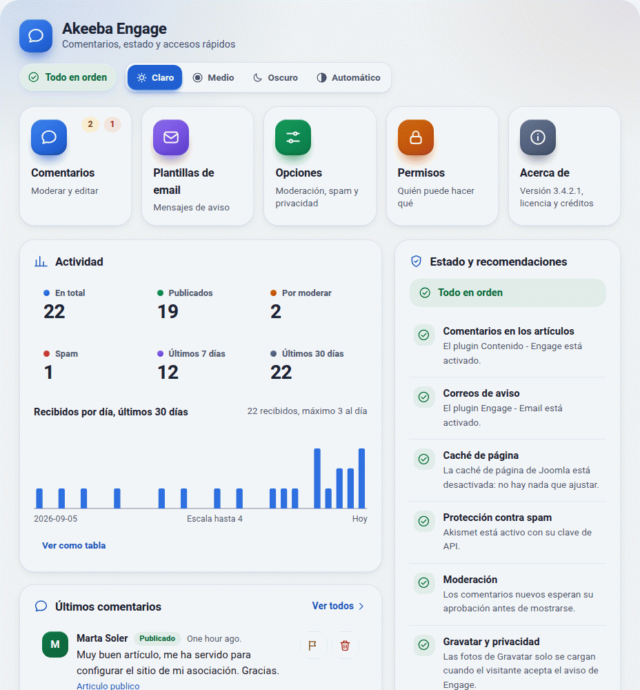
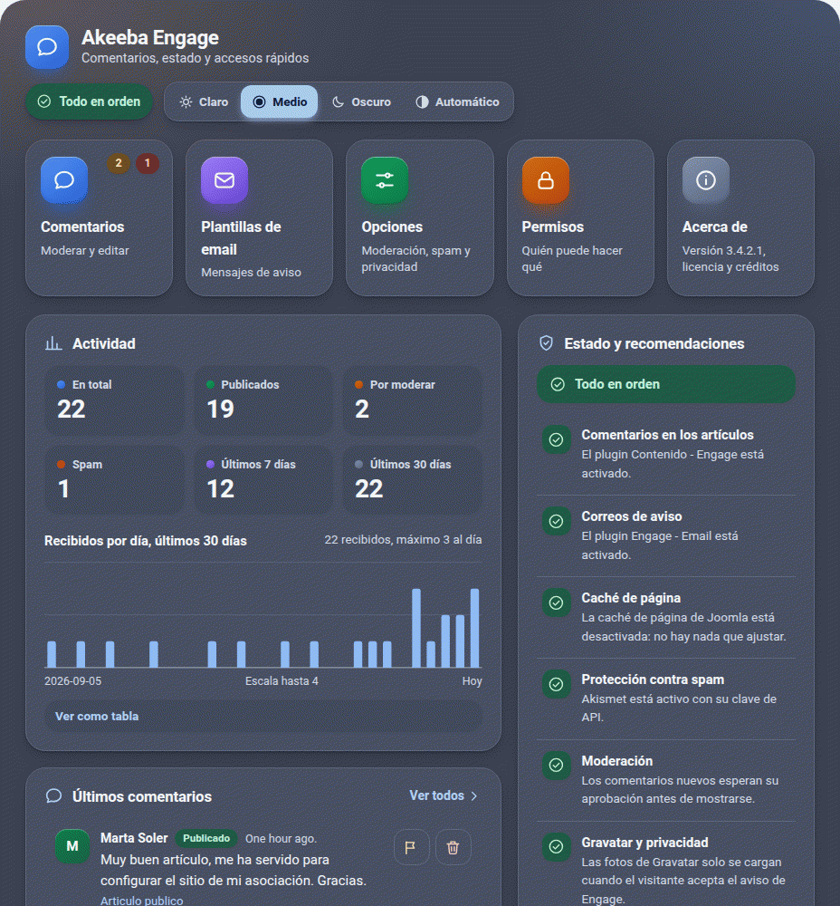
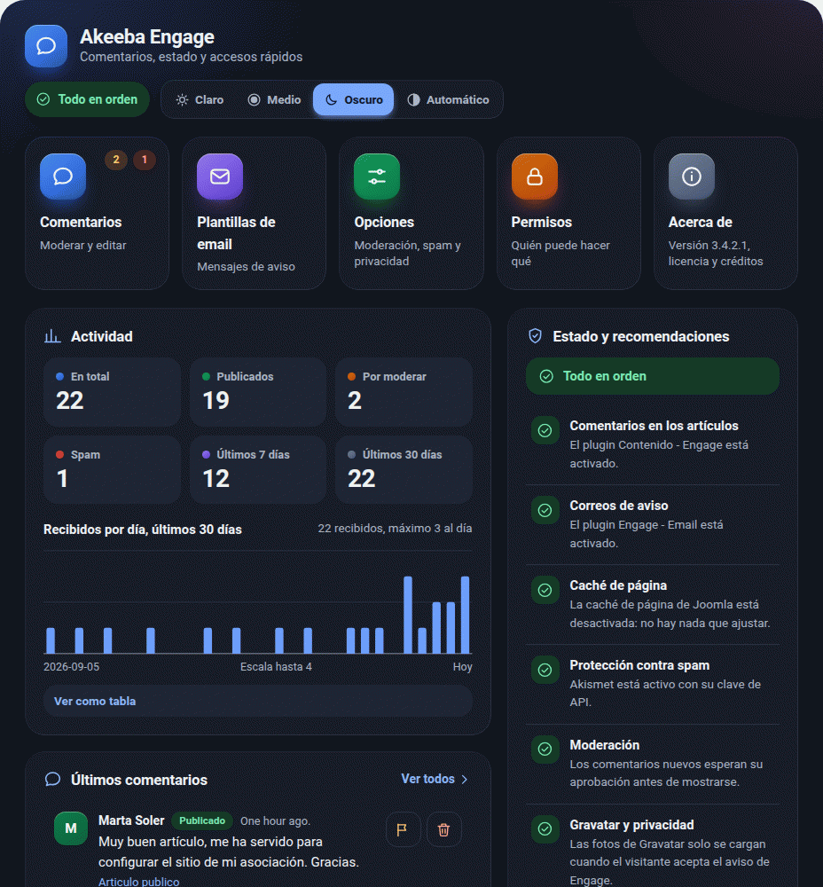
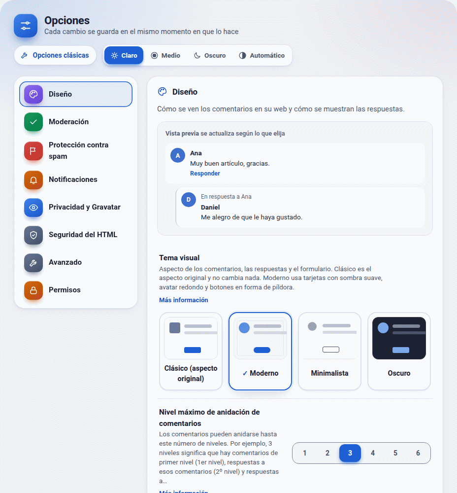
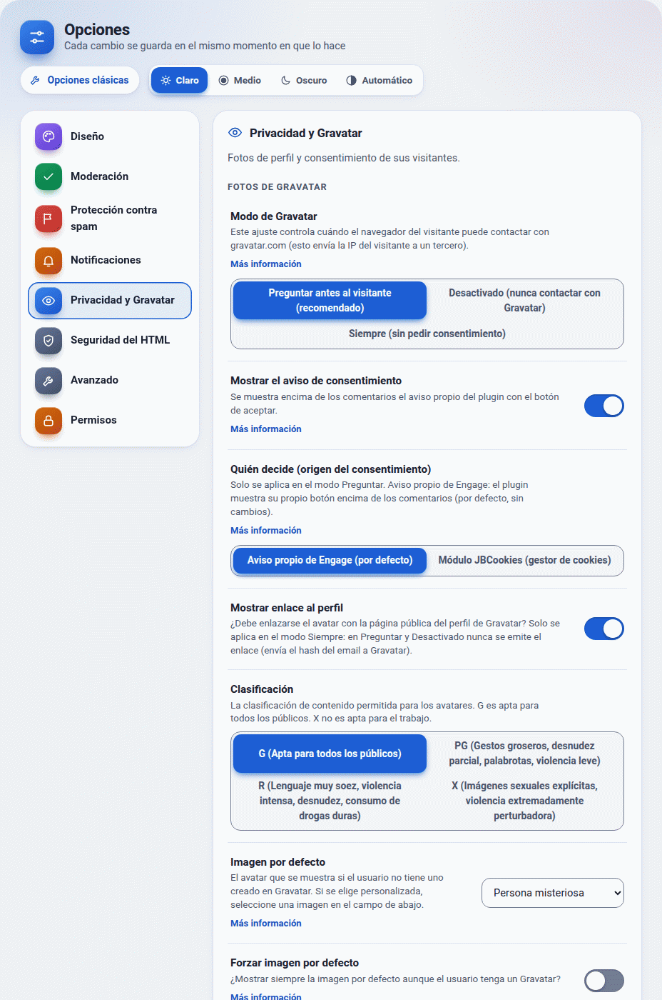

# Panel de control y opciones modernas de Engage (0.6.24 y 0.6.25)

Desde la 0.6.24, al pulsar **Akeeba Engage** en el menú de administración de Joomla se abre un **panel de control** en lugar de caer directamente en la lista de comentarios. Los comentarios, las plantillas de email y las opciones siguen donde estaban y funcionan igual.

## Qué hay

- **Accesos rápidos**, con icono en cuadrado de color: Comentarios (con insignias de comentarios pendientes y de spam), Plantillas de email, Opciones y Permisos (solo si usted puede administrar el componente) y Acerca de.
- **Actividad**: total, publicados, por moderar, spam y comentarios recibidos en los últimos 7 y 30 días, con un mini-gráfico de barras de los últimos 30 días. El gráfico es un SVG dibujado en la propia página (sin librerías); tiene descripción para lectores de pantalla, ventana de detalle al pasar el ratón o tocar, y una tabla con los mismos datos («Ver como tabla»). Los días se cuentan en UTC.
- **Últimos comentarios** con acciones rápidas: publicar, marcar como spam y eliminar. Cada acción abre una ventana de confirmación propia (accesible, con el foco en «Cancelar»; nunca el `confirm()` del navegador) y, al aceptar, usa las tareas que ya existían (`comments.publish`, `comments.possiblespam`, `comments.delete`) con el token de seguridad de Joomla y vuelve al panel. Los botones solo aparecen si usted tiene el permiso correspondiente (cambiar estado, eliminar), y las tareas lo vuelven a comprobar en el servidor. «Marcar como spam» no borra: deja el comentario en el estado de spam, donde se puede revisar.
- **Más comentados**: los cinco contenidos con más comentarios publicados.
- **Estado y recomendaciones** (semáforo verde, ámbar y rojo, con icono y texto, nunca solo color) y un botón para arreglar cada punto:

| Punto | Rojo | Ámbar |
|---|---|---|
| Plugin de contenido (comentarios en los artículos) | desactivado o no instalado | |
| Plugin de correo (avisos) | | desactivado o no instalado |
| Caché de página | | caché de Joomla activa y plugin de caché de Engage apagado |
| Protección contra spam | | sin CAPTCHA válido ni Akismet con clave |
| Moderación | publicación inmediata y sin ninguna protección contra spam | |
| Gravatar | | modo «siempre» (contacta con gravatar.com sin consentimiento) o JBCookies sin grupo |
| Filtro de HTML | etiqueta peligrosa en la lista (`script`, `iframe`, `object`, `embed`, `style`, `form`) | modo «joomla», o `img[src]` permitido (el visitante contacta con el servidor de la imagen) |
| Carpeta de caché de HTML Purifier | | no escribible o no comprobable |
| Versión de PHP | menor que 8.1 | menor que 8.2 |
| Versión de la base de datos | menor que 8.0.13 (MySQL) o 10.4.0 (MariaDB) | no se pudo leer |
| Servidor de actualizaciones | | no hay, está desactivado o no apunta al fork |

- **Acerca de**: versión del paquete instalado (la guarda Joomla), versión del fork, licencia (GPL v3 o posterior), autor original (Nicholas K. Dionysopoulos / Akeeba Ltd) y el aviso de que es un fork comunitario no oficial, sin afiliación con Akeeba Ltd, con enlaces al repositorio, al registro de cambios, a esta documentación y al sitio del autor original.

## Tres diseños y «Automático»

El selector de la cabecera tiene **Claro**, **Medio** (pizarra de tono cálido), **Oscuro** y **Automático** (sigue el modo claro/oscuro del dispositivo). La preferencia se guarda en el navegador (`localStorage`, clave `eg-admin-theme`, dentro de `try/catch`) y se aplica **antes de pintar** la página (un script pequeño sin `defer` en la cabecera), así que no hay parpadeo. Sin JavaScript, o sin preferencia guardada, manda el dispositivo por CSS puro.

El diseño del panel es independiente del tema de administración de Joomla (Atum claro u oscuro): todo el CSS cuelga del contenedor `.eg-admin` y de variables `--eg-admin-*`, y no toca nada fuera de él. El selector se maneja con teclado (flechas, Inicio y Fin) y anuncia el cambio a los lectores de pantalla.

### Accesibilidad

Teclado completo y foco visible en todos los controles, `role="radiogroup"` en el selector, `role="status"` para los avisos, ventana modal con `<dialog>`, `prefers-reduced-motion`, modo de contraste forzado, adaptable desde 360 px, sin estilos ni scripts en línea (compatible con una CSP estricta). El contraste se **mide**: `tests/28-panel.php` calcula 250+ pares sobre las variables del CSS y `tests/joomla-live/11-panel.sh` mide en Chromium cada texto visible del panel contra su fondo real (mínimo 4,5:1; 3:1 para iconos, gráfico y anillo de foco) en los tres diseños y en escritorio y móvil.

## Permisos

- Ver el panel: `core.manage` del componente (Joomla lo exige antes de llegar a nuestro código).
- Accesos a Opciones y Permisos y botón «Opciones» de la barra: `core.admin` o `core.options`.
- Publicar y marcar como spam: `core.edit.state`. Eliminar: `core.delete`. Los comprueban las tareas existentes.
- Los botones para abrir un plugin solo se ofrecen si usted puede gestionar y editar plugins.

## Privacidad: cero conexiones externas

El panel **no se conecta a ningún servidor**: no comprueba versiones, no descarga noticias, no carga tipografías, iconos ni scripts de ningún CDN. Los iconos son SVG propios dentro de la página y la tipografía es la del sistema. Los únicos enlaces a otros sitios (repositorio, registro de cambios, documentación y autor original) los abre usted y llevan `rel="noopener noreferrer"`. `tests/joomla-live/11-panel.sh` registra todas las peticiones del navegador y exige que ninguna sea a otro host.

## Actualizar desde la 3.4.2: el menú de administración

Comprobado en un Joomla 6.1.4 real, actualizando desde el paquete 3.4.2 original (`tests/joomla-live/04-actualizacion.sh`): el elemento «Akeeba Engage» del menú sigue apuntando a `index.php?option=com_engage` y ahora abre el panel. Joomla vuelve a crear los elementos del menú al actualizar (el identificador del elemento cambia, el título y el enlace no) y, como el manifiesto declara ahora un submenú, aparecen debajo **Panel de control**, **Comentarios** y **Plantillas de email**. No hay cambios en la base de datos. Cualquier enlace antiguo con `view=comments` o `view=emailtemplates` sigue funcionando.

## Archivos

`backend/src/Controller/ControlpanelController.php`, `backend/src/View/Controlpanel/HtmlView.php`, `backend/tmpl/controlpanel/default.php`, `backend/src/Helper/Panel{Data,Health,Chart,Icons}.php`, `media/css/panel.css`, `media/js/panel.js`, `media/js/panel-theme.js`, cadenas `COM_ENGAGE_PANEL_*` en `com_engage.ini` y `COM_ENGAGE_MENU_*` en `com_engage.sys.ini` (en-GB y es-ES). `PanelHealth` y `PanelChart` son funciones puras (probadas con datos simulados); `PanelData` solo lee de la base de datos, con el constructor de consultas de Joomla y parámetros enlazados.

---

# Opciones modernas (0.6.25)

La pantalla **Opciones** (menú de Engage > Opciones, o la tarjeta «Opciones» del panel) es una alternativa a la pantalla de opciones de Joomla: categorías a la izquierda, a la derecha filas «etiqueta + control» con una ayuda breve debajo, y **cada cambio se guarda al instante**, sin pulsar «Guardar y cerrar». La pantalla clásica sigue disponible con el botón **Opciones clásicas** (barra de herramientas y cabecera), y siempre es la que tiene todos los campos.

## Categorías y controles

| Categoría | Qué contiene |
|---|---|
| **Diseño** | Vista previa en vivo de un hilo (cambia al elegir sangría, cita y marca de las respuestas y el tema), tema visual con **tarjetas de vista previa** (Clásico, Moderno, Minimalista, Oscuro), nivel máximo de anidación, cita «En respuesta a», sangría, marca visual, orden y dónde mostrar el resumen de comentarios |
| **Moderación** | Publicación inmediata o con aprobación, comentarios abiertos o cerrados, cierre automático, longitud mínima y máxima, elementos por página |
| **Protección contra spam** | CAPTCHA (los plugins de captcha activados) y a quién se exige, aceptación de condiciones y su texto, y Akismet (clave, a quién se comprueba, descartar spam evidente) |
| **Notificaciones** | Aviso al autor del contenido y a quienes participan; correo a los gestores (plugin de correo) |
| **Privacidad y Gravatar** | Modo de Gravatar (preguntar, apagado, siempre), aviso, origen del consentimiento (aviso de Engage o JBCookies) y grupo de JBCookies, enlace al perfil, calificación e imagen por defecto |
| **Seguridad del HTML** | Modo de filtrado, uso del filtrado de Joomla, lista de etiquetas permitidas de HTML Purifier, modo de inclusión |
| **Avanzado** | Solución de plantillas de correo, URL de búsqueda de IP, antigüedad del spam, CSS personalizado y otros |
| **Permisos** | Enlace a la pantalla de permisos de Joomla |

Cada ajuste usa el control que le corresponde por su definición en `config.xml` (o en el manifiesto del plugin): **interruptor** (`role="switch"`) para sí/no, **control segmentado** (`role="radiogroup"`, con flechas) para listas cortas y enteros de pocos valores, **selector** para listas largas, **campo numérico** o **de texto** con validación, y **área de texto** para la lista de etiquetas. Las dependencias (`showon`) de `config.xml` se respetan: lo que no aplica se oculta. Etiquetas y ayudas son las cadenas que ya existían (la ayuda se acorta a una frase y el resto queda en «Más información»). En móvil las categorías pasan a una tira horizontal de pestañas.

Los tres diseños (Claro, Medio, Oscuro, Automático) son los mismos del panel y se eligen con el mismo selector.

## Cómo se guarda (y qué se vigila)

Cada cambio envía por `fetch` un `POST` a `index.php?option=com_engage&task=settings.save&format=json` con `scope`, `key`, `value` y el **token CSRF de Joomla**. Se muestra un aviso discreto («Guardado»; en rojo si algo falla), la fila indica «Guardando…/Guardado», y **si el servidor lo rechaza o no responde, el control vuelve al valor anterior** y se avisa.

En el servidor (`SettingsController::save`, `SettingsService`, `SettingsSchema`, `SettingsStorage`):

1. Solo `POST`, con token válido (si no, 405/403).
2. **Ámbito**: lista cerrada (`com_engage` y los plugins de Engage `gravatar`, `akismet` y `email`). Cualquier otro componente o plugin se rechaza.
3. **Permiso**: `core.admin` o `core.options` del componente (los mismos que la pantalla clásica) y, para los plugins de Engage, además `core.manage` y `core.edit` de `com_plugins`. Se comprueba **antes** de mirar clave o valor.
4. **Clave**: solo las declaradas en `config.xml` o en el manifiesto del plugin (el esquema se lee de esos ficheros en cada petición). Los campos de permisos (`rules`), de módulo (`login_module`) y de archivo (`custom_default`) no se aceptan: siguen en las opciones clásicas.
5. **Valor**: validado con la definición del propio campo (opciones permitidas de las listas, rango y paso de los enteros, longitud, caracteres permitidos), con reglas extra para `iplookup` (URL `http(s)` con un único `%s`), la lista de HTML Purifier (solo caracteres de su sintaxis), la clave de Akismet y el grupo de JBCookies; los campos de texto pasan además por el filtro de Joomla indicado en el campo (`safehtml` para el texto de las condiciones). Se rechazan arrays, objetos, NUL, caracteres de control, UTF-8 inválido y cadenas por encima del límite del campo (de 64 a 4000 caracteres según el campo).
6. **Escritura**: se leen los parámetros actuales de la base de datos, se cambia **solo esa clave** y se guarda con `Table Extension` de Joomla (sin tablas nuevas); se vuelve a leer para comprobarlo y se limpia la caché del sistema. Repetir el mismo valor no escribe nada (idempotente).
7. **Respuestas genéricas**: 403 (sin permiso o token), 422 (ámbito, clave o valor no válidos, sin decir cuál), 500 (no se pudo guardar). Cabeceras `no-store` y `nosniff`; el cuerpo nunca repite lo recibido.
8. **Registro de acciones**: si el plugin de registro de Engage está activado se anota «el usuario X cambió el ajuste Y (ámbito)» en el Registro de acciones de Joomla, **sin el valor** (puede ser una clave de API).

Nada de esto puede tocar permisos, parámetros de otras extensiones ni escalar privilegios: lo que no está en la lista cerrada de ámbitos y claves no se escribe.

## Pruebas

`tests/29-ajustes.php` (239 comprobaciones; esquema leído de los manifiestos reales, validación por tipo, servicio con permisos/almacén simulados, seguridad estática) y `tests/joomla-live/12-ajustes.sh` (navegador y HTTP reales sobre Joomla 6.1.4; ver `tests/joomla-live/LEEME.md`).

## Filas con controles anchos (0.6.26)

La fila «etiqueta + control» es ahora una fila flexible con salto de línea: la columna de texto pide como mínimo 16 rem y, si el control no cabe a su lado, baja a la línea siguiente (a la izquierda). Los controles segmentados con opciones largas (más de 4 opciones, más de 40 caracteres en total o alguna de más de 24; p. ej. «Modo de Gravatar» y «Clasificación») pasan siempre a pila: etiqueta y ayuda arriba y el control debajo a todo el ancho, con las opciones repartidas y envueltas en varias líneas. Es CSS y un criterio del servidor (clase `eg-row--wide`); no depende de JavaScript. Los interruptores, selectores, números y segmentados cortos no cambian.

