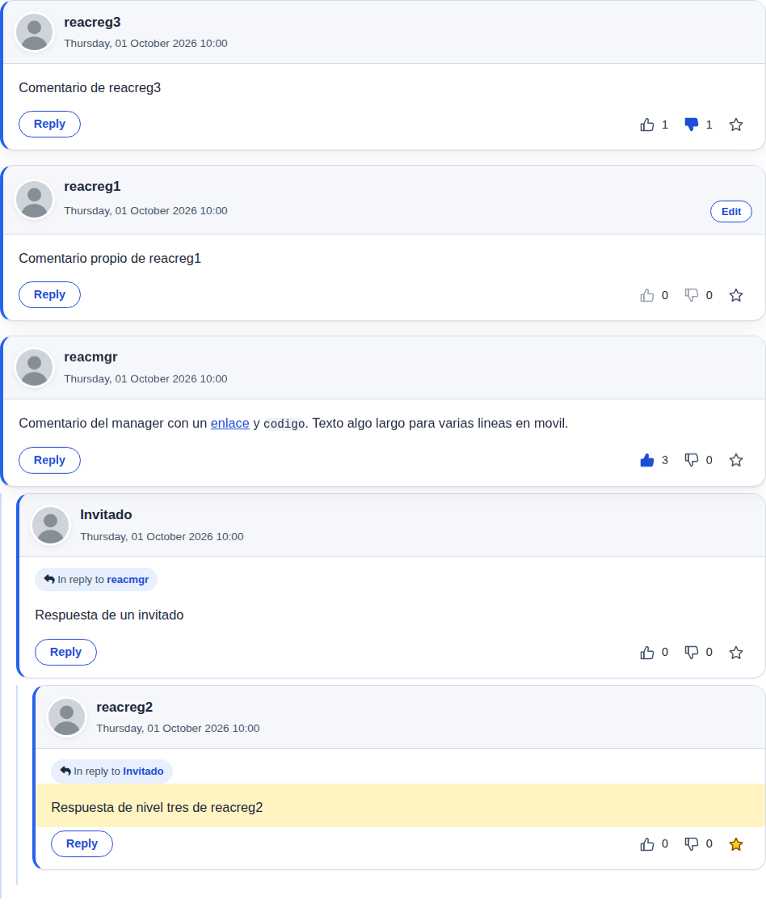
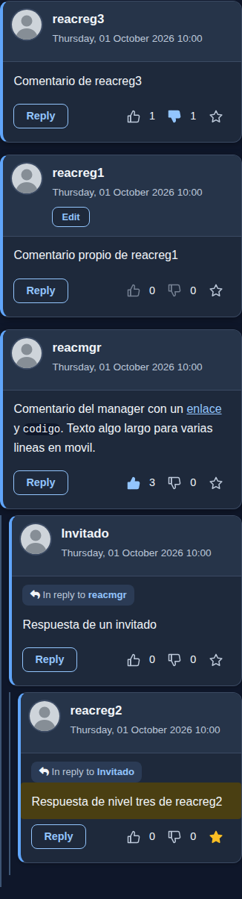
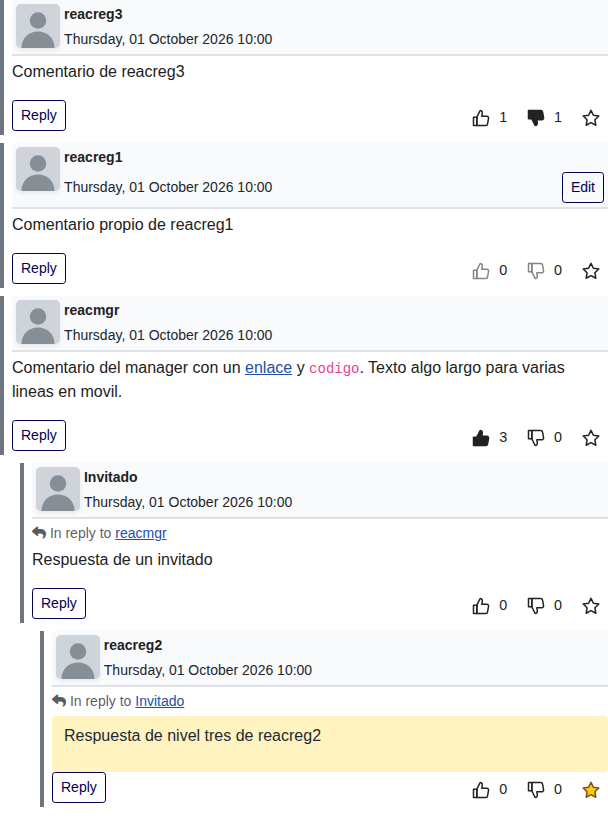

# Reacciones a los comentarios: me gusta, no me gusta y favorito (0.7.0)

Copyright (c)2026 fork comunitario de Engage iniciado por ChasKa; GNU General Public License v3 o posterior.

Petición de ChasKa: botones de **me gusta** (pulgar arriba), **no me gusta** (pulgar abajo) y **favorito** (estrella), dibujados solo con contorno y **rellenos cuando están pulsados**, abajo a la derecha de cada comentario, en la misma línea que «Responder». Los me gusta y no me gusta **se acumulan** y llevan un **contador**. Un comentario marcado como favorito muestra la estrella amarilla rellena y **el cuerpo del mensaje en amarillo suave**, para localizarlo en una lista larga.

## Cómo funciona (decisiones de diseño)

1. **Solo reaccionan usuarios con sesión iniciada** (igual que comentar exige registro en la mayoría de sitios). Los invitados ven los contadores en solo lectura y los botones deshabilitados, con una pista accesible («Inicie sesión para reaccionar a los comentarios»). La opción `reactions_who` elige quién: `registered` (por defecto, cualquier usuario con sesión) o `commenters` (solo quien tiene permiso de comentar: `core.create` del componente).
2. **Me gusta y no me gusta se excluyen** para cada persona y comentario: pulsar el otro cambia la reacción; volver a pulsar el mismo la quita. **No se puede dar me gusta ni no me gusta al propio comentario** (lo valida el servidor, no solo el botón). **Sí se puede marcar como favorito el propio.**
3. **El favorito es personal y privado**: solo lo ve quien lo marcó (estrella y fondo amarillo). No hay contador público de favoritos y ninguna respuesta del servidor revela quién reaccionó a qué.
4. **Solo se reacciona a comentarios publicados** (`enabled = 1`) de un contenido que el usuario puede ver (publicado y con su nivel de acceso y el de su categoría). Los comentarios sin publicar, en spam, borrados o de contenidos restringidos responden igual que uno inexistente.
5. **Límite de frecuencia**: 60 reacciones por minuto y usuario (HTTP 429 genérico). Las consultas de lectura no cuentan.

## Opciones

En *Componentes > Akeeba Engage > Opciones* hay una pestaña nueva **Reacciones**, y también una categoría **Reacciones** (icono de corazón) en las opciones modernas, con interruptores que se guardan al instante. Los valores se validan como lista cerrada o 0/1 (el servidor rechaza cualquier otro).

| Opción | Valores | Por defecto | Efecto |
|---|---|---|---|
| `reactions_enabled` | Sí / No | **Sí** | Con «No» no se pinta nada (ni botones, ni script, ni la fila nueva) y el servidor responde 404 a escrituras y `enabled:false` a consultas. |
| `reactions_dislike` | Sí / No | Sí | Quita el pulgar abajo y su contador (el servidor rechaza escribir «dislike»). |
| `reactions_favorites` | Sí / No | Sí | Quita la estrella y el fondo amarillo (aunque haya favoritos guardados). |
| `reactions_who` | `registered` / `commenters` | `registered` | Quién puede reaccionar. Un valor ajeno se trata como `registered`. |

**Impacto de actualizar:** las reacciones vienen **activadas por defecto**. Quien no las quiera debe poner «Botones de reacción: No»; con ello el HTML de los comentarios vuelve a ser el de la 0.6.28 (comprobado con las pruebas de HTML y estilos calculados). Tema Clásico y reacciones activadas: la fila de «Responder» pasa a ser una fila flexible (botón a la izquierda, reacciones a la derecha) y aparece la botonera.

## Cómo se ve

- **Botonera** a la derecha de la fila de «Responder» (`.akengage-comment-reply--react`, flex con espacio entre). En pantallas estrechas la fila hace *wrap* sin solaparse: la botonera baja a su propia línea, pegada a la derecha.
- **Iconos SVG propios en línea**, de contorno (`stroke: currentColor`) y con relleno cuando `aria-pressed="true"`. Sin Font Awesome ni recursos externos. Estrella pulsada: relleno amarillo y contorno marrón (se distingue de cualquier fondo, claro u oscuro).
- Contador junto a me gusta y no me gusta (`aria-live="polite"`); el favorito no lleva contador.
- Área táctil de **40 px o más por debajo de 576 px** (34 px en escritorio), foco visible por teclado (anillo de 2 px), animación suave (un pequeño «pop» al pulsar) que se desactiva con `prefers-reduced-motion`.
- **Favorito**: el artículo recibe la clase `akengage-is-favorite` y el **cuerpo** del comentario se pinta de amarillo suave. El color es la variable `--eg-fav-fondo`, definida en los cuatro temas (ver [`TEMAS.md`](TEMAS.md)). El contraste del texto sobre el amarillo es de al menos 4,5:1 en cada tema y con el dispositivo en modo claro u oscuro (con el tema Clásico la hoja fija además el color del texto, de los enlaces y de las notas para garantizarlo en cualquier plantilla). Medido en navegador: mínimo 9,5:1 (Oscuro), 13,2:1 (Moderno), 13,2:1 (Clásico) y 14,6:1 (Minimalista).
- Sin estilos en línea (CSP). `reply_style`, sangría, avatar en móvil, iconos del nombre y demás opciones de diseño se conservan.

## Caché de página

El HTML que sirve Joomla **no lleva ningún estado por usuario**: solo un esqueleto de botones (`data-engage-id`, `aria-pressed="false"`, oculto con el atributo `hidden`). Un JavaScript pequeño (`media/js/reactions.js`, sin dependencias, registrado en `joomla.asset.json` como `com_engage.reactions`) hace **una sola consulta GET** con los identificadores de la página (paginación y respuestas incluidas, máximo 100 por petición) y pinta `aria-pressed`, los rellenos, los contadores y los favoritos. **Sin JavaScript los botones no se muestran** (mejora progresiva) y «Responder» sigue como siempre.

Por eso funciona con la caché de página y la caché conservadora de Joomla: la página cacheada es la misma para todos y el estado de cada persona llega por AJAX (con `Cache-Control: no-store, private` y `Vary: Cookie`). El token CSRF tampoco va en el HTML: lo entrega esa misma consulta, solo a quien tiene sesión y puede reaccionar.

## Tareas del servidor

Ambas responden JSON, sin caché, con `X-Content-Type-Options: nosniff` y errores 4xx genéricos (el cuerpo nunca repite lo recibido ni explica qué falló).

| Tarea | URL (sin SEF) | Método | Qué hace |
|---|---|---|---|
| `reactions.state` | `index.php?option=com_engage&task=reactions.state&format=json&ids=1,2,3` | GET (sin efectos) | Contadores de me gusta / no me gusta y estado propio de hasta 100 comentarios. Los no publicados o no visibles se omiten. A quien tiene sesión le entrega además su token. |
| `reactions.toggle` | `index.php?option=com_engage&task=reactions.toggle&format=json` | POST con token CSRF de Joomla | Parámetros `comment_id` (entero) y `type` (`like`, `dislike`, `favorite`). Alterna la reacción dentro de una transacción y devuelve el estado y los contadores nuevos. |

Códigos: 200 correcto; 400 parámetro no válido; 403 sin sesión, sin permiso, token ausente o falso, comentario propio (me gusta/no me gusta) o petición iniciada por otro sitio; 404 comentario inexistente, sin publicar, de otro contenido o reacciones desactivadas; 405 método no permitido; 429 límite de frecuencia; 500 fallo interno. Código: `ReactionsController` (sitio), lógica en `Reactions`, SQL en `ReactionStore`, limitador en `ReactionRateLimiter` y iconos en `ReactionIcons` (carpeta `backend/src/Helper`).

## Base de datos

Tabla nueva **aditiva** `#__engage_reactions` (InnoDB, utf8mb4): `id`, `comment_id`, `user_id`, `type` (1 = me gusta, 2 = no me gusta, 3 = favorito), `created`. Clave única `(comment_id, user_id, type)` e índices por `comment_id` y por `user_id`. **No se modifica la tabla de comentarios.** Sin PostgreSQL (como el resto del componente).

- `install.mysql.utf8.sql`: la crea (`CREATE TABLE IF NOT EXISTS`).
- `sql/updates/mysql/3.4.3-20261007.sql`: la crea al actualizar (idempotente). Joomla guarda en `#__schemas` el nombre del último fichero de actualización ejecutado; la 3.4.2 original y la 3.4.2.1 publicada lo dejaron en `3.0.2-20220107`, y `3.4.3-20261007` es mayor según `version_compare`, así que se ejecuta en ambos casos y el esquema pasa a `3.4.3-20261007`. Comprobado en un Joomla real desde la 3.4.2 original y desde el paquete 3.4.2.1 publicado (ver abajo).
- `uninstall.mysql.utf8.sql`: la elimina.

**Limpieza:** al borrar un comentario (y sus respuestas en cascada) se borran sus reacciones (`CommentTable`); al borrar un artículo, las de sus comentarios (plugin `content/engage`); al borrar un usuario, **las que hizo** (plugin `user/engage`).

## Privacidad (RGPD)

Qué se guarda por cada reacción: **el identificador del usuario, el identificador del comentario, el tipo de reacción y la fecha y hora**. Nada más (ni IP, ni navegador). Las reacciones de visitantes sin sesión no existen. El favorito solo lo ve quien lo marcó, y ninguna pantalla pública ni el panel muestran quién reaccionó (el panel solo suma totales y puntuaciones).

El plugin `privacy/engage` (herramientas de privacidad de Joomla):

- **Exporta** las reacciones del usuario (dominio `engage_reactions`: id, comentario, tipo en texto y fecha). Solo las suyas.
- **Elimina** las reacciones del usuario al atender una solicitud de supresión. Las reacciones que otras personas hicieron a sus comentarios no son sus datos y se conservan (los comentarios se seudonimizan como hasta ahora).

Texto sugerido para la **Política de privacidad** del sitio (adáptelo):

> **Reacciones a los comentarios.** Si inicia sesión y pulsa «me gusta», «no me gusta» o «favorito» en un comentario, guardamos su identificador de usuario, el comentario, el tipo de reacción y la fecha y hora. Lo hacemos para mostrar a todos los contadores de me gusta y no me gusta (sin indicar quién reaccionó) y para que usted vea sus propios favoritos marcados; los favoritos son privados y solo usted los ve. Base jurídica: nuestro interés legítimo en ofrecer esta función, que usted usa voluntariamente. Se conservan mientras exista su cuenta y se eliminan si borra su cuenta o nos pide la supresión de sus datos. Puede ver, exportar o suprimir sus reacciones solicitándolo en [su formulario de privacidad/correo del responsable].

## Seguridad

Revisión hecha con ojos de atacante sobre todo lo que añade la 0.7.0 (todas las entradas de la petición, todas las salidas HTML y JSON, todas las consultas y los permisos). Lo que se comprobó, y cómo:

| Riesgo | Cómo se evita | Cómo se comprobó |
|---|---|---|
| **Inyección SQL** | Todo el SQL está en `ReactionStore` y en `PanelData::reactions()`: constructor de consultas de Joomla, valores enlazados (`bind`, `whereIn` con `ParameterType::INTEGER`); ningún valor de la petición se concatena. Los identificadores se aceptan solo como enteros positivos en decimal (`^[1-9][0-9]{0,17}$` con modificador `D`: una prueba encontró que sin él `"1\n"` pasaba) y el tipo solo de una lista cerrada. | `tests/30-reacciones.php` (base de datos simulada que registra consultas y parámetros: las cadenas hostiles no aparecen en el SQL; 30 ids y tipos no válidos) y `17-reacciones.sh`: 21 `comment_id` y 11 `type` hostiles (`1 OR 1=1`, `UNION SELECT`, `DROP TABLE`, comillas, NUL, saltos de línea, Unicode, arrays, enormes) en el Joomla real: 400, y reacciones, comentarios, usuarios, ajustes y permisos intactos (huella de las tablas antes y después). |
| **XSS** | Salida HTML: el esqueleto lo construye `reactionsHtml()` con identificador entero, tipo de una lista y textos escapados; los SVG son cadenas fijas. Salida JSON: `JSON_HEX_TAG/AMP/APOS/QUOT`, `nosniff`, sin eco de lo recibido. JavaScript: solo `textContent` y atributos fijos; sin `innerHTML`, `eval` ni URL dinámicas; los identificadores se validan como enteros. Panel: todo con `htmlspecialchars`. | Pruebas estáticas del JS, la vista y la plantilla; respuestas de error que no contienen la entrada hostil; `reactions.js` ejecutado en Chromium con cero errores de consola. |
| **HTML inyectado en un comentario** (un botón falso con `data-engage-*` en el texto, para que otra persona reaccione sin querer) | `reactions.js` solo hace caso a botones dentro de la botonera de **su** comentario, fuera del texto del comentario (`.akengage-comment-body`) y con el mismo identificador que el artículo (`trusted()`). | Prueba en Chromium: un botón inyectado en el texto y otro dentro del artículo con un id ajeno no envían ninguna petición. |
| **CSRF** | Escribir exige **POST** con el token de formulario de Joomla (`Session::checkToken('post')`, antes de ninguna otra lógica); GET no tiene efectos. Defensa extra: se rechazan las peticiones con `Sec-Fetch-Site: cross-site`. El token no va en el HTML (que puede estar en caché): lo entrega la consulta GET, solo a la persona con sesión. | HTTP real: sin token, token inventado, token de otra sesión, token en la URL en lugar del cuerpo, token a 0, GET con token válido (405), PUT, cuerpo JSON, invitado con token ajeno y petición `cross-site`: todas rechazadas y sin escribir nada. |
| **Permisos y acceso a datos ajenos** | El usuario sale siempre de la sesión (nunca de la petición). Solo comentarios publicados de contenido que el usuario puede ver (publicado, nivel de acceso del artículo y de su categoría). Los no disponibles responden con la misma 404. Nunca se devuelve quién reaccionó; el favorito solo se devuelve a su dueño; el comentario propio no admite me gusta/no me gusta. | HTTP real con invitado, dos Registered y un Manager: restringido, sin publicar, spam, artículo sin publicar, artículo al que el usuario pierde el acceso a mitad de prueba, `reactions_who=commenters` (con permisos cambiados en la base de datos), favoritos de otra persona invisibles. |
| **Abuso (spam de reacciones)** | Límite de 60 reacciones por minuto y usuario (caché de Joomla por usuario; la sesión como respaldo), 429 genérico; consultas acotadas a 100 ids; una petición no válida no gasta cupo. El límite es un freno, no una garantía atómica (dos peticiones simultáneas pueden contar una vez). Varias cuentas pueden inflar un contador: es inherente a cualquier sistema de votos con registro abierto. | HTTP real: 60 respuestas 200 y el resto 429; otro usuario no se ve afectado; vaciar el contador lo libera; la consulta no cuenta. |
| **Condiciones de carrera** | Transacción para cambiar entre me gusta y no me gusta; clave única `(comment_id, user_id, type)` que impide duplicados; un `INSERT` que choca con la clave es una carrera benigna, no un error. | Doble clic rápido en Chromium (0 o 1 filas); consulta `MAX(COUNT)` por clave. |
| **Fuga de información en errores** | 4xx genéricos con cuerpo fijo; sin trazas ni mensajes de excepción; inexistente, sin publicar, de otro contenido o sin acceso: la misma respuesta. | Pruebas HTTP y estáticas. |
| **Caché** | `Cache-Control: no-store, private` y `Vary: Cookie` en las dos tareas; el HTML cacheado es idéntico para todos. | Chromium con la caché de página de Joomla activada: el HTML cacheado no tiene estado y dos usuarios ven su favorito sobre la misma página. |
| **Datos personales** | Solo id de usuario, comentario, tipo y fecha; exportación y supresión por el plugin de privacidad; borrado al borrar el usuario, el comentario o el artículo; el panel no muestra quién reaccionó. | CLI de Joomla real: modelos `Export` y `Remove` de `com_privacy` y `User::delete()`. |
| **Código de terceros / recursos externos** | Sin dependencias nuevas, sin CDN ni fuentes; iconos SVG propios en línea; el navegador de pruebas registra cero peticiones a otros dominios. | Prueba de red en Chromium. |

Limitaciones conocidas: el limitador depende de la caché de Joomla (si su caché está desactivada o falla, usa la sesión, que se renueva al volver a iniciar sesión); un sitio con CORS abierto en Joomla (`Access-Control-Allow-Origin`) debe seguir sin permitir credenciales de otros orígenes (valor por defecto); y un sitio con un CDN que ignore `Cache-Control: no-store` en URLs con `?task=` no debería cachear estas rutas.

## Pruebas

- `php tests/30-reacciones.php`: lógica, almacén, limitador, privacidad, esquema SQL, opciones validadas por el esquema, cadenas en los dos idiomas, seguridad estática y contraste del favorito.
- `tests/joomla-live/17-reacciones.sh` (Joomla real): HTTP (`lib/reacciones-http.php`), RGPD y borrado de usuarios (`lib/reacciones-cli.php`) y Chromium (`lib/reacciones-navegador.js`: 5 variantes de tema x página clara/oscura x 390/768/1280 px, teclado, lector, persistencia, sin JavaScript, caché de página, opciones). Los resultados con sus números están en [`RESULTADOS-PRUEBAS-JOOMLA-REAL.md`](RESULTADOS-PRUEBAS-JOOMLA-REAL.md).
- `tests/joomla-live/04-actualizacion.sh`: actualización desde la 3.4.2 original y, con `PKG_ANTES=/ruta/pkg_engage-3.4.2.1.zip`, desde el paquete publicado.
