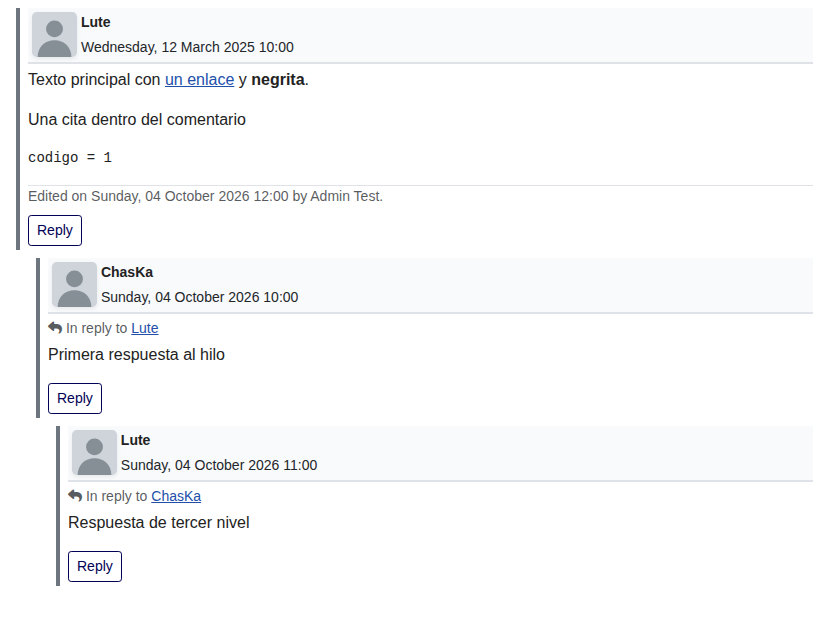
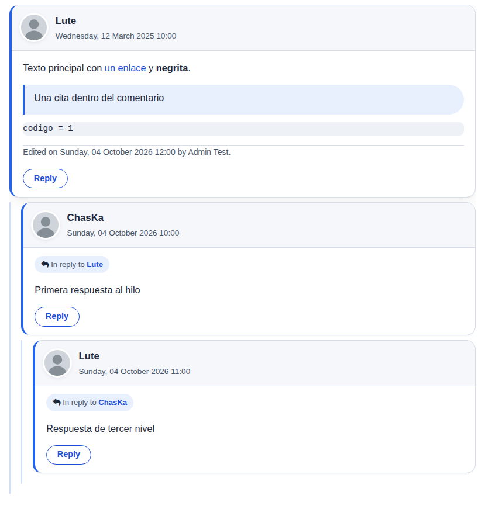
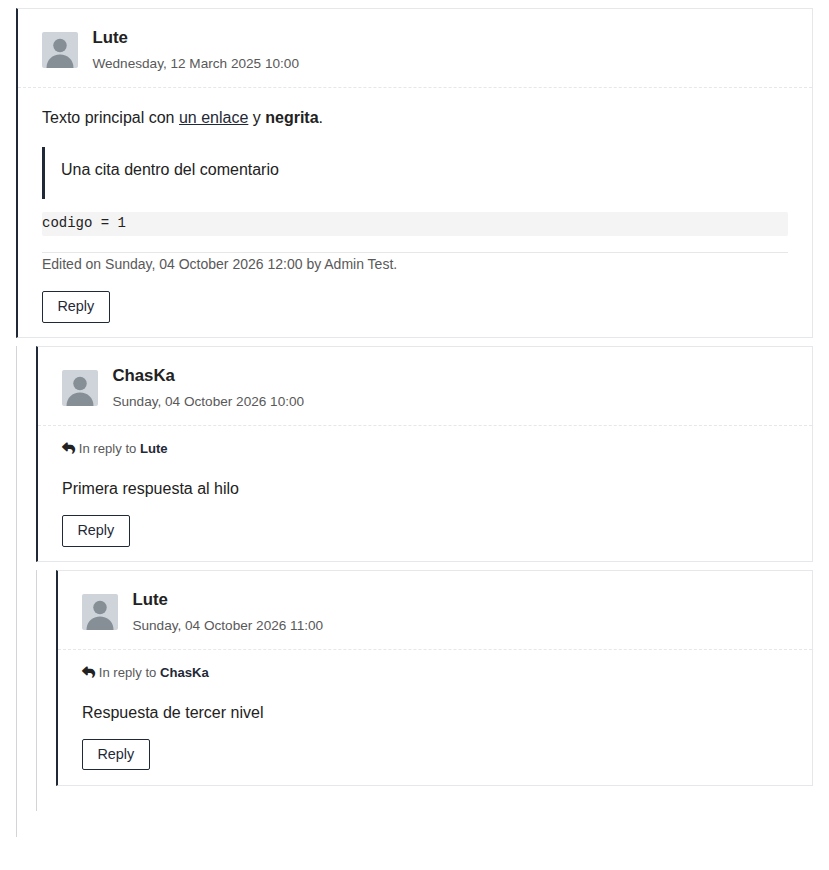
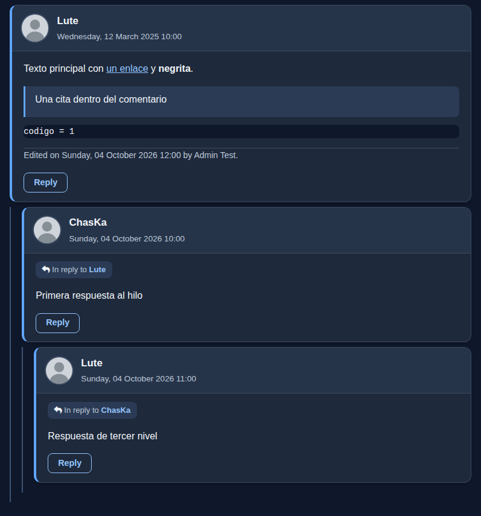

# Temas visuales de los comentarios (0.6.23)

Desde la 0.6.23 puede elegir el aspecto de los comentarios sin pegar CSS: **Componentes > Engage > Opciones > pestaña «Apariencia» > «Tema visual»**.

| Valor | Tema | Qué es |
|---|---|---|
| `classic` | Clásico (**por defecto**) | El aspecto original. No carga ninguna hoja nueva ni cambia nada: quien actualiza sin tocar la opción ve exactamente lo mismo que antes. |
| `modern` | Moderno | Tarjetas blancas con sombra suave, cabecera clara, avatar redondo, botones en forma de píldora, la nota «En respuesta a» como etiqueta y un hilo con guía vertical. |
| `minimal` | Minimalista | Sin sombras, líneas finas, mucho aire y la tipografía de su plantilla. Fondo blanco y texto oscuro. |
| `dark` | Oscuro | Panel y tarjetas oscuros con texto claro. Pensado para plantillas oscuras; también se lee sobre páginas claras, porque el panel lleva su propio fondo. |

## Capturas

Hilo de tres niveles (invitado, página clara, 1100 px). Se generan con `tests/joomla-live/10-temas.sh`.

| Clásico | Moderno |
|---|---|
|  |  |
| **Minimalista** | **Oscuro** |
|  |  |

## Cómo funcionan

- Cada tema es **una hoja CSS** (`media/com_engage/css/themes/moderno.css`, `minimalista.css`, `oscuro.css`) registrada en `joomla.asset.json` como `com_engage.theme.modern`, `com_engage.theme.minimal` y `com_engage.theme.dark`. Se carga **solo si está elegido**, después de `replies.css` y de `comments.css` (si usa «Cargar CSS personalizado», el tema manda sobre ella). Con `classic` no se carga nada.
- La plantilla pone la clase `akengage-theme--<valor>` en el contenedor (`<section class="akengage-outer-container akengage-theme--modern">`) y todos los selectores del tema empiezan por `section.akengage-outer-container.akengage-theme--<valor>`: no tocan nada fuera de los comentarios. El valor pasa por una lista blanca y sale escapado. No hay estilos en línea (compatible con CSP) ni cambios en la base de datos.
- **Legible sobre cualquier plantilla.** Cada tema fija siempre **fondo y color de texto** de la tarjeta (y los de enlaces, nombre, fecha, botones y cita), y blinda el color del texto con `!important` frente a plantillas que fuerzan un color a todos los elementos (por ejemplo Helix Ultimate en modo oscuro). Se ha comprobado con medición de contraste WCAG sobre páginas claras, oscuras y «hostiles» (véase abajo).
- Funciona con la caché de página (la clase es HTML estático; la hoja la registra el gestor de recursos de Joomla) y no afecta al módulo «Últimos comentarios», que no usa este contenedor. **Tras cambiar de tema, vacíe la caché de página** para que las páginas ya guardadas lleven la clase nueva.
- Se ve también el formulario de comentar (campos, botón «Enviar», aviso «En respuesta a», botón de ocultar) y el aviso de Gravatar. El editor TinyMCE de Joomla conserva su propio aspecto.

## Qué hace cada tema con las opciones de «Respuestas»

- `reply_show_quote` (nota «En respuesta a»): sigue igual; el tema solo le da estilo (Moderno: etiqueta; Minimalista: línea de texto sencilla; Oscuro: etiqueta oscura).
- `reply_indent` (sangría): **no se toca**. La sangría por nivel es la misma que con `classic` (comprobado en el navegador para las cuatro opciones). La guía vertical del hilo se dibuja con una sombra interior, sin desplazar nada, y se oculta con sangría «Ninguna».
- `reply_style` (marca de las respuestas):
  - **Línea lateral** (`line`): las respuestas llevan la barra lateral de color propia del tema (acento si está publicada, ámbar si es posible spam, rojo si no está publicada).
  - **Fondo suave** (`soft`): `replies.css` (más específico) quita la barra lateral de las respuestas publicadas y les pone el fondo `--eg-fondo-respuesta` del tema, siempre **opaco** y con su texto fijado, para que siga leyéndose. Las respuestas sin publicar o de spam conservan su barra.
  - **Ninguna** (`none`): sin barra en las respuestas publicadas; queda la tarjeta con su borde fino.

## Avatar en móvil (0.6.28)

Opción **Componentes > Engage > Opciones > Apariencia > «Avatar en móvil»** (`mobile_avatar`; en las opciones modernas, categoría Diseño, justo debajo del tema). Controla el avatar por debajo de 576 px de ancho (móvil y escritorio estrechado). El Engage original lo ocultaba en pantallas estrechas con las clases de Bootstrap `d-none d-sm-block`.

| Valor | Efecto por debajo de 576 px |
|---|---|
| `auto` (**por defecto**) | Decide el tema. **Clásico** conserva el comportamiento original (avatar oculto; el HTML y el CSS son idénticos a los de antes). **Moderno, Minimalista y Oscuro** muestran el avatar reducido. |
| `show` | Avatar visible con cualquier tema, también con Clásico. |
| `hide` | Avatar oculto con cualquier tema. |

- Con el avatar visible en móvil: queda a la izquierda (40 px; 36 px en Minimalista; variable `--eg-avatar-movil`), con el nombre, los iconos y la fecha a su derecha y los botones de moderación debajo, sin desbordar. Si no hay foto de Gravatar aceptada se ve la silueta local de siempre.
- Cómo funciona: la plantilla no cambia el HTML del avatar (conserva `d-none d-sm-block`); solo añade al contenedor la clase `akengage-mobile-avatar--show` o `akengage-mobile-avatar--hide` (valor de lista blanca, escapado), y `replies.css` la usa para sobrescribir la regla de Bootstrap. Con Clásico y `auto` no se añade ninguna clase. Sin estilos en línea ni JavaScript. No se piden más imágenes ni se contacta con Gravatar por esta opción.
- Tamaño propio desde el CSS de su plantilla: `:root { --eg-avatar-movil: 44px; }`.
- Desde 576 px la opción no cambia nada. Tras cambiarla, vacíe la caché de página.

## Modo oscuro del dispositivo

- **Clásico** conserva su comportamiento original: con «Cargar CSS personalizado» activado, `comments.css` lleva un bloque `@media (prefers-color-scheme: dark)` que oscurece los comentarios cuando el dispositivo del visitante está en modo oscuro, aunque el resto de la web siga clara. Si eso le pasa y no lo quiere, elija el tema Moderno o Minimalista (se quedan claros) o desactive «Cargar CSS personalizado».
- **Moderno** y **Minimalista** se ven **claros** siempre, también con el dispositivo en modo oscuro: el tema pisa ese bloque de `comments.css` (incluida la fecha, que `comments.css` pinta con `!important`).
- **Oscuro** se ve **oscuro** siempre, con el dispositivo en modo claro u oscuro.

## Variables CSS (`--eg-*`)

Todos los colores y medidas del tema son variables definidas en `:root` de la hoja del tema. Para cambiarlas, **redefínalas después** de esa hoja: en el CSS personalizado de su plantilla (Cassiopeia: `media/templates/site/cassiopeia/css/user.css`; Helix Ultimate: «CSS personalizado») o en el ajuste de Engage «Cargar CSS personalizado» si su plantilla permite añadir hojas después de la de Engage. Ejemplo (tema Moderno con acento verde y tarjetas menos redondeadas):

```css
:root {
	--eg-acento: #15803d;
	--eg-enlace: #166534;
	--eg-enlace-hover: #14532d;
	--eg-guia: rgba(21, 128, 61, .25);
	--eg-radio: 8px;
	--eg-sombra: none;
}
```

Regla de oro: si cambia un color de fondo, cambie también el de su texto. Mantenga un contraste mínimo de 4,5:1 entre `--eg-texto` y `--eg-fondo`, `--eg-fondo-cabecera`, `--eg-fondo-spam` y `--eg-fondo-sinpublicar`; entre `--eg-enlace` y los fondos; y entre `--eg-sobre-boton` y `--eg-enlace` / `--eg-b` (los botones, al pasar el ratón, usan su color como fondo). El tema Oscuro usa colores claros para texto y botones y `--eg-sobre-boton` oscuro.

`--akengage-reply-bg` (fondo suave de `reply_style`) toma el valor de `--eg-fondo-respuesta`; `--akengage-reply-indent` sigue mandando sobre la opción de sangría, como antes.

Valores por defecto de cada tema:

| Variable | Qué controla | Moderno | Minimalista | Oscuro |
|---|---|---|---|---|
| `--eg-acento` | color de decoración: barra lateral, guía, foco | `#2563eb` | `#1f2937` | `#60a5fa` |
| `--eg-enlace` | enlaces y botones (contraste mínimo 4,5:1 con el fondo de la tarjeta) | `#1d4ed8` | `#1f2937` | `#93c5fd` |
| `--eg-enlace-hover` | enlaces y botón principal al pasar el ratón | `#1e3a8a` | `#000000` | `#dbeafe` |
| `--eg-sobre-boton` | texto sobre un botón relleno | `#ffffff` | `#ffffff` | `#0b1220` |
| `--eg-sobre-boton-hover` | texto del botón principal al pasar el ratón | `#ffffff` | `#ffffff` | `#0b1220` |
| `--eg-boton-solido-borde` | borde de los botones rellenos (los separa de una página oscura) | `#ffffff` | `#ffffff` | `#93c5fd` |
| `--eg-fondo` | fondo de la tarjeta | `#ffffff` | `#ffffff` | `#1e293b` |
| `--eg-fondo-cabecera` | fondo de la cabecera de la tarjeta | `#f5f7fb` | `#ffffff` | `#263449` |
| `--eg-fondo-respuesta` | fondo de las respuestas con reply_style = soft | `#f1f5fd` | `#fafafa` | `#233147` |
| `--eg-fondo-boton` | fondo de los botones con borde | `#ffffff` | `#ffffff` | `#1e293b` |
| `--eg-borde` | bordes y separadores | `#d5dce8` | `#e5e7eb` | `#3b4a63` |
| `--eg-texto` | texto principal | `#1e293b` | `#222222` | `#f1f5f9` |
| `--eg-texto-suave` | fechas, IP, correo y textos secundarios | `#475569` | `#595959` | `#bcc8d9` |
| `--eg-cita-fondo` | fondo de la etiqueta «En respuesta a» y de las citas | `#e8effd` | `#ffffff` | `#2b3b55` |
| `--eg-codigo-fondo` | fondo de código | `#eef2f7` | `#f4f4f4` | `#0f172a` |
| `--eg-codigo-texto` | texto de código | `#1e293b` | `#222222` | `#e2e8f0` |
| `--eg-ok` | verde: nombre de usuario, «No es spam» | `#15803d` | `#166534` | `#86efac` |
| `--eg-peligro` | rojo: borrar, invitado | `#b91c1c` | `#b91c1c` | `#fca5a5` |
| `--eg-aviso` | ámbar oscuro: moderador, «Posible spam» | `#92400e` | `#92400e` | `#fcd34d` |
| `--eg-spam` | barra lateral de «Posible spam» | `#d97706` | `#b45309` | `#f59e0b` |
| `--eg-fondo-spam` | fondo de la tarjeta de «Posible spam» | `#fffbeb` | `#fffdf5` | `#2e2814` |
| `--eg-sinpublicar` | barra lateral de «Sin publicar» | `#dc2626` | `#b91c1c` | `#f87171` |
| `--eg-fondo-sinpublicar` | fondo de la tarjeta «Sin publicar» | `#fef2f2` | `#fffafa` | `#33202a` |
| `--eg-banner-spam-fondo` | franja «Posible spam»: fondo | `#92400e` | `#ffffff` | `#78350f` |
| `--eg-banner-spam-texto` | franja «Posible spam»: texto | `#ffffff` | `#92400e` | `#fef3c7` |
| `--eg-banner-sinpublicar-fondo` | franja «Sin publicar»: fondo | `#b91c1c` | `#ffffff` | `#7f1d1d` |
| `--eg-banner-sinpublicar-texto` | franja «Sin publicar»: texto | `#ffffff` | `#b91c1c` | `#fee2e2` |
| `--eg-guia` | línea vertical del hilo de respuestas | `rgba(37, 99, 235, .22)` | `#d4d4d8` | `rgba(147, 197, 253, .35)` |
| `--eg-foco` | anillo de foco de los campos | `rgba(37, 99, 235, .25)` | `rgba(31, 41, 55, .20)` | `rgba(147, 197, 253, .35)` |
| `--eg-input-fondo` | campos del formulario: fondo | `#ffffff` | `#ffffff` | `#0f172a` |
| `--eg-input-texto` | campos del formulario: texto | `#1e293b` | `#222222` | `#f1f5f9` |
| `--eg-input-borde` | campos del formulario: borde | `#94a3b8` | `#8a8a8a` | `#64748b` |
| `--eg-panel-fondo` | fondo del contenedor completo (transparente en este tema) | `transparent` | `transparent` | `#0f172a` |
| `--eg-panel-texto` | texto del contenedor completo (el de la plantilla en este tema) | `inherit` | `inherit` | `#e2e8f0` |
| `--eg-radio` | redondeo de la tarjeta | `16px` | `0` | `12px` |
| `--eg-radio-boton` | redondeo de los botones | `999px` | `2px` | `8px` |
| `--eg-radio-cita` | redondeo de la etiqueta de cita | `999px` | `0` | `8px` |
| `--eg-radio-aviso` | redondeo del aviso de Gravatar (caja de varias líneas) | `14px` | `0` | `10px` |
| `--eg-radio-avatar` | redondeo del avatar | `50%` | `2px` | `50%` |
| `--eg-avatar-movil` | tamaño del avatar por debajo de 576 px (opción «Avatar en móvil») | `40px` | `36px` | `40px` |
| `--eg-radio-campo` | redondeo de campos y código | `8px` | `2px` | `8px` |
| `--eg-sombra` | sombra de la tarjeta | `0 1px 2px rgba(15, 23, 42, .06), 0 8px 24px rgba(15, 23, 42, .06)` | `none` | `0 2px 10px rgba(0, 0, 0, .35)` |
| `--eg-sombra-hover` | sombra al pasar el ratón | `0 2px 4px rgba(15, 23, 42, .08), 0 14px 32px rgba(15, 23, 42, .10)` | `none` | `0 4px 16px rgba(0, 0, 0, .45)` |
| `--eg-sombra-respuesta` | sombra de las respuestas | `0 1px 2px rgba(15, 23, 42, .05)` | `none` | `0 1px 4px rgba(0, 0, 0, .30)` |
| `--eg-sombra-avatar` | sombra y aro del avatar | `0 0 0 3px #ffffff, 0 2px 8px rgba(15, 23, 42, .15)` | `none` | `0 0 0 2px #3b4a63` |
| `--eg-borde-ancho` | grosor del borde de la tarjeta | `1px` | `1px` | `1px` |
| `--eg-barra-ancho` | grosor de la barra lateral de estado | `4px` | `2px` | `4px` |
| `--eg-guia-ancho` | grosor de la guía del hilo | `2px` | `1px` | `2px` |
| `--eg-separacion` | espacio entre comentarios | `1.1rem` | `1.6rem` | `1rem` |
| `--eg-relleno` | relleno horizontal del texto | `1.2rem` | `1.5rem` | `1.2rem` |
| `--eg-relleno-cabecera` | relleno de la cabecera | `.85rem 1rem` | `1rem 1.5rem .75rem` | `.8rem 1rem` |
| `--eg-cita-relleno` | relleno de la etiqueta de cita | `.3rem .7rem` | `0` | `.25rem .65rem` |
| `--eg-boton-relleno` | relleno de los botones de moderación | `.2rem .8rem` | `.15rem .65rem` | `.2rem .75rem` |
| `--eg-boton-responder-relleno` | relleno del botón Responder | `.3rem 1.1rem` | `.25rem .9rem` | `.3rem 1rem` |
| `--eg-panel-relleno` | relleno del contenedor completo | `0` | `0` | `1rem` |
| `--eg-panel-radio` | redondeo del contenedor completo | `0` | `0` | `14px` |
| `--eg-fuente` | tipografía (heredada de la plantilla) | `inherit` | `inherit` | `inherit` |
| `--eg-fuente-tam` | tamaño del texto del comentario | `1.02rem` | `inherit` | `1rem` |
| `--eg-interlineado` | interlineado del comentario | `1.6` | `1.7` | `1.6` |
| `--eg-movimiento` | transiciones | `box-shadow .2s ease, transform .2s ease, background-color .15s ease, color .15s ease` | `background-color .15s ease, color .15s ease` | `box-shadow .2s ease, background-color .15s ease, color .15s ease` |

## Pruebas y medición de contraste

`tests/27-temas.php` (estático) y `tests/joomla-live/10-temas.sh` (Chromium sobre un Joomla 6.1.4 real) comprueban por cada tema, sobre una página clara (`body` #fff / #222), una oscura (`body` #1a1a1a / #f1f1f1 `!important`, como Helix en modo oscuro) y dos plantillas «hostiles» que fuerzan el color de **todos** los elementos con `!important` después del CSS del tema (`html,body,body *{color:#f5f5f5 !important}` sobre `#222`, y `#111` sobre blanco), en 1100 px y 400 px y con un hilo de tres niveles más un comentario sin publicar y otro de spam: el contraste de **todo** el texto visible del contenedor (nombre, fecha, enlaces, cita, botones, estados, campos del formulario) contra su fondo efectivo, y el de los botones con el ratón encima. Umbral 4,5:1 (3:1 para texto grande y para los bordes de botones y campos). Resultados en `CHANGELOG.md` (0.6.23).

## Limitaciones

- Un tema no sustituye a un diseño a medida: si necesita algo distinto, parta de las variables y añada sus propias reglas.
- Si activa «Cargar CSS personalizado» junto con un tema, `comments.css` se sigue cargando y el tema prevalece sobre ella en colores y bordes de las tarjetas.
